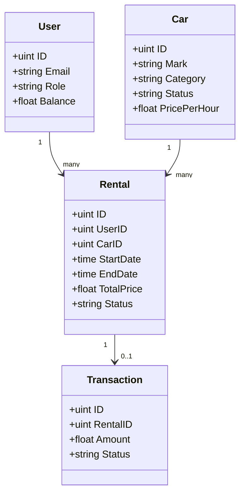
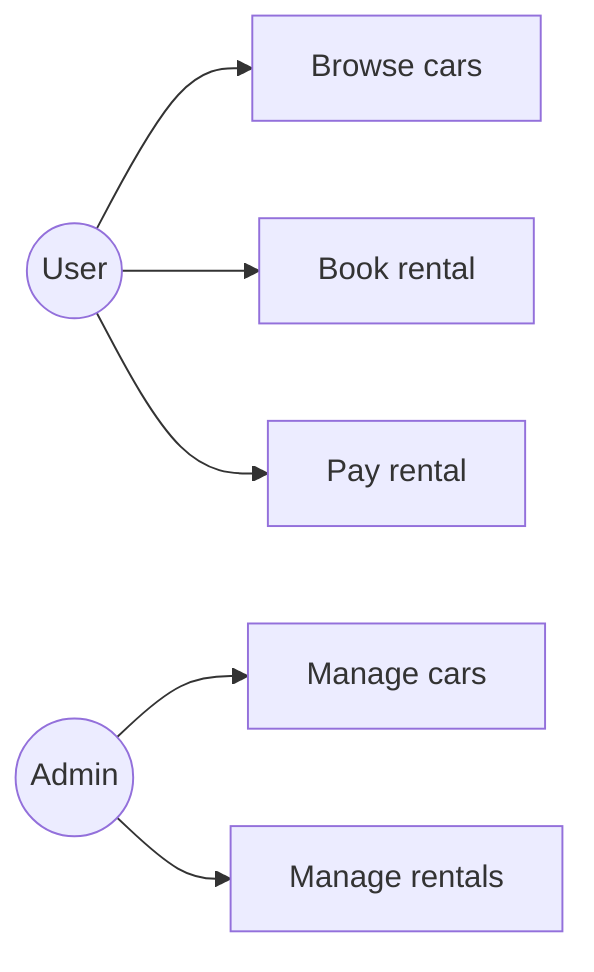
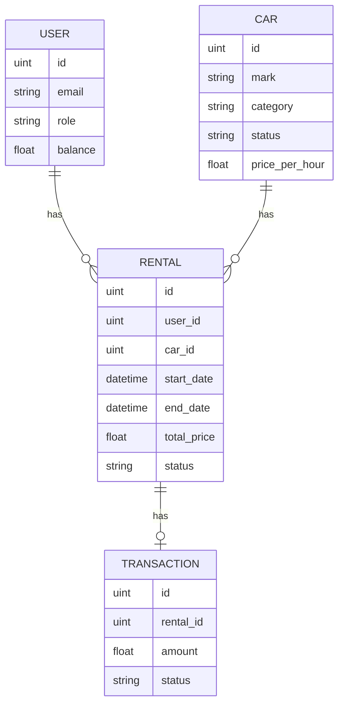

# Project Documentation

## Architecture & Decisions
- **REST API** with consistent responses: `{ "status": "ok|error", "message": "...", "data": ... }`.
- **JWT authentication** with role-based authorization.
- **Transactional booking** to prevent race conditions.
- **Separation of concerns**: handlers, services/logic, and models.

## Data Models (GORM/JSON)
Source: internal/models/models.go

### User
- `email` unique
- `role` in {admin, client, corporate}
- `balance` non‑negative
- `rating` 0..5

### Car
- `category` in {economy, business, luxury}
- `status` in {available, booked, maintenance}
- `price_per_hour` > 0

### Rental
- `status` in {pending, active, completed, cancelled}
- `start_date < end_date`
- Linked to User, Car

### Transaction
- `status` in {success, failed}
- `amount` > 0

## Core Endpoints (Examples)

### Auth
- POST /auth/register
```json
{"email":"user@mail.com","password":"password123","first_name":"A","last_name":"B"}
```
- POST /auth/login
```json
{"email":"user@mail.com","password":"password123"}
```

### Cars
- GET /api/v1/cars?category=economy&sort=price_per_hour&order=asc
- POST /api/v1/cars (admin)
```json
{"mark":"Toyota","model":"Camry","category":"business","status":"available","price_per_hour":10,"metadata":"Sedan"}
```

### Rentals
- POST /api/v1/rentals
```json
{"car_id":1,"start_date":"2026-02-01T10:00:00Z","end_date":"2026-02-01T18:00:00Z"}
```
- POST /api/v1/rentals/{id}/pay
- POST /api/v1/rentals/{id}/finish
- POST /api/v1/rentals/{id}/cancel

### Balance
- GET /api/v1/users/balance
- PATCH /api/v1/users/balance
```json
{"amount":50}
```

## UML (Class Diagram)


## Use‑Case Diagram


## ERD


## Booking Rules (Safety)
- Overlap check: `start1 < end2 AND end1 > start2`.
- Transactional update for rental creation + car status change.
- Ownership check for user actions (unless admin).

