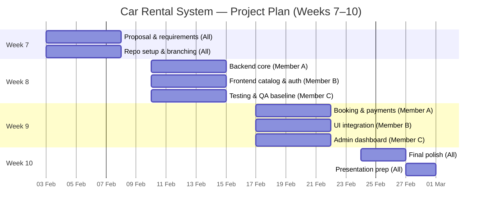

# Project Plan (Weeks 7–10)

## Responsibilities
- **Member A**: Backend features, transactions, booking flow.
- **Member B**: Frontend catalog, auth, booking UI.
- **Member C**: Admin tools, QA, integration testing.
